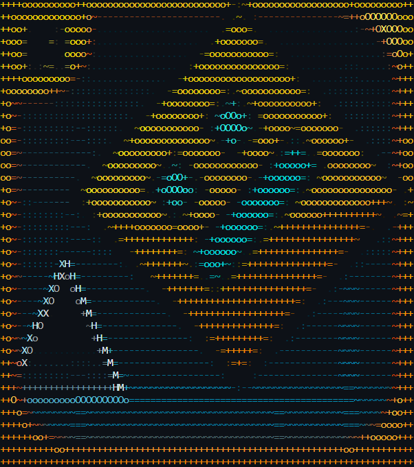
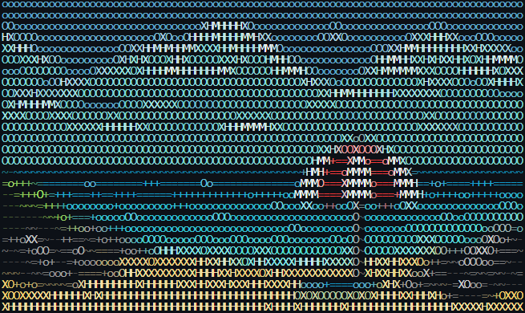

[](https://github.com/Louis-CharlesBiron/ImgToText/commits/main/)
[](https://github.com/Louis-CharlesBiron/ImgToText/commits/main/)
[](https://www.npmjs.com/package/imgtotext)
[](https://www.npmjs.com/package/imgtotext)


# ImgToText

## **ImgToText is a concise library that converts any image/video into custom text**

**This library makes your website able to generate live text conversions of pretty much any given media, and thus can be used to create some pretty interesting effects!**

And if you don't know much about code and only want to use the converted text, you can check out this [simple web interface](https://embelliron.com/lcb_tests/imgToText/)!

<span style="font-size:10px;font-family:monospace;">
                                                                     
            .oXXXXXXXXXXXXXXXXXXXXXXXXXXXXXXXXXXXXXXXXXXXXXX= 
            OMMMMMMMMMMMMMMMMMMMMMMMMMMMMMMMMMMMMMMMMMMMMMMMM-   
            XMMM~........................................OMMM~  
            XMMM-                         .~++~.         OMMM~   
            XMMM-                        :HMMMMM-        OMMM~      MMMMMMMM                                                               MMMMMMMMMM                                        
            XMMM-                        -MMMMMM=        OMMM~    MMMMMMMMM                                                               MMMMMMMMMM                                         
            XMMM-                         -oXXO~         OMMM~     MMM               MMMMMMMM        MMMMMMMMMM         MMMMMMM               MMM          MMMMMMMMMMM        MMMMMMMMMM     
            XMMM-       +O:                              OMMM~     MMMMM            MMMMMMMMMM       MMMMMMMMMMM      MMMMMMMMMM              MMM          MMMMMMMMMMM       MMMMMMMMMMM     
            XMMM-     +HMMMX=                            OMMM~      MMMMMMMM        MMM    MMM       MMM MMM MMM      MMM    MMM              MMM          MMMM MMM MM       MMM   MMMM      
            XMMM-   =MMMMMMMMMo.            .+XMX=.      OMMM~         MMMMMM      MMMM    MMM       MM  MM  MMM      MMMMMMMMMM              MMM          MMM  MM  MM       MMMMMMMMM       
            XMMM-.=HMMMMMMMMMMMMX-       -oHMMMMMMMX=.   OMMM~            MMM       MMM    MMM       MM  MM  MMM      MMM                     MMM          MMM  MM  MM       MMMMMMMMM    
            XMMMoMMMMMMMMMMMMMMMMMH=..~OMMMMMMMMMMMMMMX=.OMMM~     MMM  MMMMM       MMMMMMMMMM       MM  MM  MMM      MMMMMMMMMM              MMM          MMM  MM  MM       MMMMMM       
            XMMMMMMMMMMMMMMMMMMMMMMMMMMMMMMMMMMMMMMMMMMMMMMMM~     MMMMMMMMM         MMMMMMMM        MM  MM  MMM       MMMMMMMMM           MMMMMMMMMM      MMM  MM  MM       MMMMMMMMMM   
            XMMMMMMMMMMMMMMMMMMMMMMMMMMMMMMMMMMMMMMMMMMMMMMMM~                                                                                                                MMM   MMMMM 
            XMMMMMMMMMMMMMMMMMMMMMMMMMMMMMMMMMMMMMMMMMMMMMMMM~                                                                                                                MMMMMMMMMM
            XMMMMMMMMMMMMMMMMMMMMMMMMMMMMMMMMMMMMMMMMMMMMMMMM~                                                                                                                MMMMMMMMM
            XMMMMMMMMMMMMMMMMMMMMMMMMMMMMMMMMMMMMMMMMMMMMMMMM~
            XMMMMMMMMMMMMMMMMMMMMMMMMMMMMMMMMMMMMMMMMMMMMMMMM~
            OMMMMMMMMMMMMMMMMMMMMMMMMMMMMMMMMMMMMMMMMMMMMMMMM-
            .oHMMMMMMMMMMMMMMMMMMMMMMMMMMMMMMMMMMMMMMMMMMMHX= 
</span>

<br>

# Table of Contents

- [Getting Started](#getting-started)
- [ImageToTextConverter Class](#imagetotextconverter)
- [Visual Examples](#visual-examples)
- [Npx commands](#npx-commands)
- [Optimization](#optimization)
- [Notes](#notes)
- [Credits](#credits)

## Getting Started

1. **Get the library file. (`npm install imgtotext` or [imgToText.min.js](https://github.com/Louis-CharlesBiron/ImgToText/blob/main/dist/imgToText.min.js))** 
```HTML
    <!-- Only if you're using the browser version! Otherwise use: import {ImageToTextConverter} from "imgtotext" -->
    <script src="imgToText.min.js"></script>
```

2. **In a JS file, create a new ImageToTextConverter instance.**
```js
    // Converts the image ("someImg.png") and logs it in the console
    const converter = new ImageToTextConverter((text)=>console.log(text), "someImg.png")
```
#

# [ImageToTextConverter](#table-of-contents)

The ImageToTextConverter class allows the full conversion and customization of images/videos to text.
#### **The constructor takes the following parameters:**
###### - `new ImageToTextConverter(resultCB, sourceMedia?, pxGroupingSize?, charSet?, useColors?, maxMediaInputSize?, maxRefreshRate?)`
- **resultCB** -> A callback called on each conversion, its only parameter is the text result of the latest conversion. `(text)=>{...}`
- **sourceMedia**? -> The image/video to convert. One of [`ImageDisplay.SOURCE_TYPES`](https://github.com/Louis-CharlesBiron/canvasDotEffect?tab=readme-ov-file#table-of-contents).
- **pxGroupingSize**? -> The pixel output resolution. E.g.: `1` converts pixels to characters at a 1:1 ratio (one character per media pixel), and `5` converts pixels to characters at a 25:1 ratio (one character per 5x5 pixels of the original media). Defaults to `5`.
- **charSet**? -> The characters used to draw the image using text, going from least visible to most visible. Either a `String` or an `Array`. Defaults to `[" ", ".", ":", "-", "~", "=", "+", "o" , "O" , "X", "H", "M"]`.
- **useColors**? -> Whether to color the generated text or keep it the default environment color (This uses HTML to render colors and thus can be VERY performance heavy).
- *colorOptimizationLevel* -> Defines the color tolerance (0..255) for character grouping optimizations when using colors. If `false` or `null`, disables the character grouping optimizations.
- **maxMediaInputSize**? -> The canvas or canvas size on which media will be drawn. Either a size array *`[width, height]`*, a *`HTMLCanvasElement`* (to see medias before conversion), a *`OffscreenCanvas`*, or a [*CDEJS `Canvas`*](https://github.com/Louis-CharlesBiron/canvasDotEffect?tab=readme-ov-file#canvas). Defaults to about `[3840, 2160]`.

- **maxRefreshRate**? -> The aimed conversions per second (mostly for videos). Defaults to `30`fps.

**Note:** - Putting `null` as any parameter value will assign it the default value of this parameter, if any. (Also applicable to most functions)


### **To load a new media** use the `loadMedia` function:
###### - loadMedia(sourceMedia, size?, croppingPositions?, errorCB?, readyCB?)
```js
    // Loading and converting a new image
    converter.loadMedia(
        "someImg.png",    // The media path
        [100, 100],       // The rendered size of the media
        [[0,0], ["50%", "100%"]]     // Cropping to only use the left half of the media 
        ()=>console.log("Image loaded!"),       // Callback called upon media load
        ()=>console.warn("Error loading image!")// Callback called upon error loading media
 )
```
```js
    // Loading and converting the live camera feed
    converter.loadMedia(ImageDisplay.loadCamera())
```

### **To format the text output of a conversion** use the *static* `formatText` function:
###### - formatText(text, outputFormatingMethod?)
```js
    // A dummy converter
    const converter = new ImageToTextConverter((text)=>{

          // Regular output (raw)
          console.log(text)

          // Adapts the output to properly render in a Markdown environment (no colors)
          console.log(ImageToTextConverter.formatText(text), ImageToTextConverter.OUTPUT_FORMATS.MARKDOWN_COLORLESS)

          // Adapts the output to properly render in an HTML environment
          console.log(ImageToTextConverter.formatText(text), ImageToTextConverter.OUTPUT_FORMATS.HTML)
    })
```

### **To force a conversion** use the `generate` function:
###### - generate()
```js
    // Updating the characters used for conversion
    converter.charSet = ImageToTextConverter.DEFAULT_CHARACTER_SETS.MIDDLE

    // Forcing a new conversion to use the newly updated characters
    converter.generate()
```

### **To create/transform an HTML file input that loads and converts medias automatically** use the `createHTMLFileInput` function:
###### - createHTMLFileInput(id?, onInputCB?)
```js
    // Creating an automated HTML file input
    const fileInput = converter.createHTMLFileInput()

    // Adding it to the DOM
    document.body.appendChild(fileInput)
```
```js
    // Accessing an already existing file input in the DOM
    const existingFileInput = document.getElementById("myFileInput")

    // Transforming it into an automated ImgToText file input
    converter.createHTMLFileInput(existingFileInput)
```

# [Visual Examples](#table-of-contents)

# Converting an image:


```
++++ooooooooooo++ooooooooooooooooooooooooooooo~::~+ooooooooooooooooooooooooooooooo++
++ooooOoooOooooooO~-::::::::::::::::::::::::.  ~=: .:::::::::::::::::--=++OXOOOOOoo+
++ooo    .:. +oooO~:.....................   :=oooo+-.  ...................-~+OXOOOoo
++ooo    .- .+ooo+~....................   ~+ooooooooo=:   ..................:~+OOoo+
++ooo    -   =oo+~:..................  :=ooooooooooooooo-.  ..................:~Oo++
+++oo+~~=o+~~++=-:................   ~+ooooooooooooooooooo=:  .......::::......-=o++
++++++oooo++=~-:::::::::::::::..  :=ooooooooo=--+oooooooooooo-.  .::.::::::::::-~O++
+oo+===~---::::::::::::::::::   ~+ooooooooo~..~~.:=oooooooooooo=:  .:::::::::::-~O++
+o+~::::::::::::::::::::::.  :=ooooooooo+- -+OOOO+- -+oooooooooooo-. .:::::::::-=O++
+o+~:::::::::::--:::::::.  ~+ooooooooooo=:.-oOOOOo-.-=oooo+:~ooooooo=:  .::::::-=O++
+o+~:::::::::::---:::.  :=ooooooooooooooooo-.:==:.~oooo+~.:~: -+ooooooo-. .::::-=O++
oo+~--------------:.  ~+ooooooooo~: :=ooooooo=:-=oooo+: -=+oo+~.:~ooooooo=:  :-~=Ooo
ooo~------------:  :+ooooooooo+-.-+o+-.-+oooooooooo~.:=oooooo+=- -+ooooooooo-. :~Ooo
ooo=----------.  ~oooooooooo+: ~oOOOOoo~ :oooooo+: -+ooooooo~..~oooooooooooooo=: :=o
+o+~:---------  -+oooooooooooo~.:=ooo=:.~ooooo~.:=ooooooo=- -+ooooooooooooooo++~. :~
+o+~::::::::---:. .~oooooooooooo=:.:.-=oooo+- -+ooooooo~..~oooooooo+++++++++=:  .==+
+o+~:::::::::::---.  -=++++oooooooo~ooooo~.:=ooooooo=- -+++++++++++++++++=-.  .:~O++
+o+~::::::::::----:::  .-+++++++++++++=: -=ooooooo~..~+++++++++++++++++=:  ..::-~O++
+o+~:::::::-~~----:::::.  -=+++++++++. -++ooooo=- -+++++++++++++++++=-.  .:::::-~O++
+o+~-------=MMo~---------:  .-++++++++~.:=+++~..~+++++++++++++++++=:  .:--------~O++
+o+~-----~oM~.HX=-----------.  :=+++++++=: : -+++++++++++++++++=-.  .-----------~O++
+o+~-----OH:   OH=------------:. .-++++++++~+++++++++++++++++=:  .::-~~~~-------~O++
+o+~---~XX.     +M+--------------.  :=++++++++++++++++++++=-.  .:----~~~~------~~O++
+o+~--=Ho        -Mo---------------:. .-++++++++++++++++=:  .:-------~~~--------~O++
+o+~-+M=          :HX~----------------.  :~++++++++++=-.  :----------~~~~------~~O++
+o+~OM-............:OH=-----------------:. .-++++++=:  .:------------~~~~------~~O++
+++=H-:::::::::::::::oM+~------------------.  :~=-.  :---------------~~~~------~~O++
+++~-::::::::::---::::=Mo~-------------------:.   .:-----------------~~~~------~=O++
++O~+oooooooooOOOOOOOOOXMO======================~~~=====================~~~~~~~~o+++
+++o~~~~~~~~~~~===~~~~~~~~~~~~~~~~~~~~~~~~~~~~~~~~~~~~~===~~~~~~~~~~~===~~~~~~~oo+++
++++o+~~~~~~~~~==~~~~~~~~~~~~~~~~~~~~~~~~~~~~~~~~~~~~~~===~~~~~~~~~~~===~~~~~+oooo++
++++++o++=~~~~~==~~~~~~~~~~~~~~~~~~~~~~~~~~~~~~~~~~~~~~===~~~~~~~~~~~===~=+oooooo+++
++++++++++oo+++++++++++++++++++++++++++++++++++++++++++++++++++++++++++oo+++++++++++
++++++++++++++++++++++++++++++++++++++++++++++++++++++++++++++++++++++++++++++++++++
```
## Or with colors:


### Settings used:

- Media width:  100%
- Media height: 40%
- Pixel Grouping Size: 3x3
- Character set (Default): [ " ", ".", ":", "-", "~", "=", "+", "o", "O", "X", "H", "M" ]


### JS code:
```js
// Creating a default ImageToTextConverter
new ImageToTextConverter(
    (text)=>{console.log(text)}, // resultCB: function called upon a conversion, here simply logging to the console
    "https://static.wikia.nocookie.net/logopedia/images/4/41/Geometry_Dash_Icon.svg", // sourceMedia: the source of the image to convert
    3 // pxGroupingGroup: grouping pixels 3x3 
)
``` 

# Converting some text
"cdejs"
```
   MMMMMMMM     MMMMMMMM        MMMMMMMMM      MMMMMMMM       MMMMMMMM      
 MMMMMMMMMM     MMMMMMMMMM      MMMMMMMMM      MMMMMMMM      MMMMMMMMM      
 MMMM           MMM   MMMM      MMM                 MMM      MMM            
MMMM            MMM    MMMM     MMM                 MMM      MMMMMM         
MMMM            MMM     MMM     MMMMMMMM            MMM       MMMMMMMM      
MMMM            MMM    MMMM     MMM                 MMM          MMMMMM     
 MMM            MMM    MMMM     MMM                 MMM             MMM     
 MMMMM   MM     MMM MMMMMM      MMM            MM  MMMM      MM    MMMM     
  MMMMMMMMM     MMMMMMMMM       MMMMMMMMM      MMMMMMM       MMMMMMMMMM     
    MMMMMM                                      MMMM          MMMMMM
```

### Settings used (All defaults):

- Text scale-x: 2
- Text scale-y: 1.25
- Pixel Grouping Size: 5x5
- Character set: [ " ", ".", ":", "-", "~", "=", "+", "o", "O", "X", "H", "M" ]
- Font: 54px monospace


### JS code:
```js
// Creating a default ImageToTextConverter and loading the text "CDEJS" to be converted
new ImageToTextConverter((text)=>{console.log(text)}, "CDEJS")
``` 

# Converting a video:


### Settings used:

- Media width:  100%
- Media height (Default): 45%
- Pixel Grouping Size: 3x3
- Character set (Default): [ " ", ".", ":", "-", "~", "=", "+", "o", "O", "X", "H", "M" ]


### JS code:
```js
    // Creating an ImageToTextConverter with a pixel grouping size of 3
    const converter = new ImageToTextConverter((text)=>console.log(text), null, 3)
    
    // Loading the video to be converted with a specific size
    converter.loadMedia("./img/exampleRaw.mp4", ["100%", "45%"])
``` 

# [Npx Commands](#table-of-contents)

Here is the list of available npx commands:

## To access all `imgtotext` commands remotely / other utility commands:

### Use: `npx imgtotext <commandName> <params?>`

This is the global `imgtotext` command. It provides access to all regular `imgtotext` commands and some more. It also provides basic command autocompletion upon receiving an incomplete command name.

#### Example use 1:
Creating a project template using the `imgtotext-template` command. (see below for more details)
`npx imgtotext template myProjectName`

#### Example use 2:
Lists all available `imgtotext` commands. (As well as aliases)
`npx imgtotext list`

### To create a template page

#### `npx imgtotext-template <projectName?>` | *`npx imgtotext-t <projectName?>`*

This command creates a **modular** ImgToText template page. It accepts an optional project name as parameter.

### To create a browser template page

#### `npx imgtotext-browser-template <projectName?>` | *`npx imgtotext-bt <projectName?>`*

This command creates a **non-modular** ImgToText template page. It accepts an optional project name as parameter.

<br>

# [Optimization](#table-of-contents)
To keep the best performance on your website/app, you may want to use some optimization techniques.

#### If performances become a concern:

- Lower the media size. The media size is the most impactful on performance, so make sure the converted media is not unnecessarily big.

- Try to avoid using colors (especially with high frequency conversions, such as videos)

- When using colors, try to make the color optimization level higher. This will try to group characters by color with the defined level of tolerance. This greatly helps to reduce the amount of HTML elements required to render the text, which in turn improves performance.

- Lower the max framerate. Having an unnecessarily high framerate when converting videos or any dynamic media is heavy on performances. Prioritise a smaller, but consistent framerate, rather than a higher but unreachable framerate.

- Make the pixel grouping size higher. This can help a bit with improving performances, but comes at the cost of image precision.


****

### [Notes](#table-of-contents)

This library is fully compatible with the [CDEJS](https://github.com/Louis-CharlesBiron/canvasDotEffect) library and accepts canvas instances as media input.

****

### [Credits](#table-of-contents)

Made by Louis-Charles Biron !


